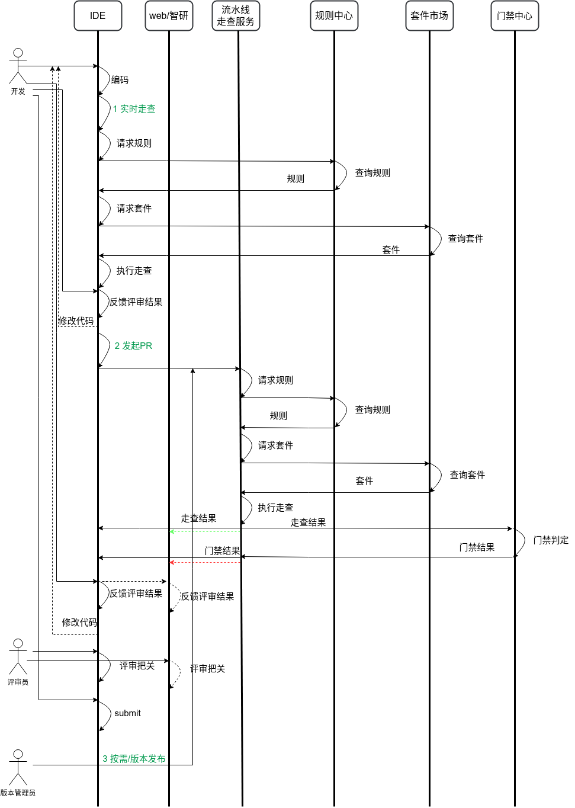

# 第三章 业务方案

**【本章定位】** 说清楚人和 AI 如何配合、AI 在什么场景下承担什么职责、规则如何分层分发到不同环节，并为第四章的系统/子系统划分提供业务能力输入。

---

## 3.1 质量防护体系设计

### 3.1.1 人-AI-工具三层协同

代码质量防护由 **静态检查工具（SAST）+ AI 评审 + 人工审查** 共同完成，三者按确定性高低互补，形成纵深防线。

|防线|职责定位|优势|劣势|协作原则|
|---|---|---|---|---|
|**静态检查工具**|执行确定性规则（空指针、资源泄漏、编码规范等）|精确、稳定、成本低、可解释|无法理解语义、无法识别业务逻辑缺陷|基本问题由工具发现，AI 辅助降噪|
|**AI 评审**|规模化发现与证据组织（语义风险、设计规约、业务逻辑异常模式）|理解上下文、可处理非结构化规则、能生成修复建议|存在幻觉、成本较高、需要人在环校准|AI 做深度评审，人做关键审查和兜底|
|**人工审查**|高风险决策、架构权衡、业务逻辑兜底|具备业务上下文和最终决策权|无法规模化、成本高、易遗漏|专家按风险等级介入，承担决策责任|

**设计原则：**

1. **能自动的不人工**：L1 高可信规则由 SAST 自动执行，AI 仅做降噪，不替代规则执行。
    
2. **能前置的不后置**：问题发现越靠前，修复成本越低。关键问题需在编码时即提示，PR 阶段设门禁，存量阶段做治理。
    
3. **不打断心流**：编码时的 AI 提示以高精确率为首要，低置信结论不打扰开发者。
    
4. **AI 自进化**：AI 从人工评审反馈、工具检出结果中持续吸收可沉淀知识，形成"发现→反馈→优化"的闭环。
    

### 3.1.2 分层协同模式

通过"分层协同"机制，实现 AI 与专家的高效分工：层级越往上，业务风险越高，专家介入越深；层级越往下，AI 覆盖越广，自动化程度越高。

┌─────────────────────────────────────────────────────────┐
│ L4 架构决策                                             │
│ 跨系统影响、方案权衡、架构反模式                          │
│ AI主动识别风险+生成影响报告 │ 专家决策                     │
├─────────────────────────────────────────────────────────┤
│ L3 业务语义风险                                          │
│ 核心流程、业务规则一致性、数据完整性                       │
│ AI辅助识别异常模式 │ 业务专家深审                         │
├─────────────────────────────────────────────────────────┤
│ L2 通用语义风险                                          │
│ 标准边界条件、常见异常处理、API契约                       │
│ AI主导分析 │ 开发人工确认                                │
├─────────────────────────────────────────────────────────┤
│ L1 高可信规则（SAST核心域）                               │
│ 空指针、资源泄漏、编码规范                                │
│ SAST自动检出 │ AI辅助降噪（过滤误报）                     │
└─────────────────────────────────────────────────────────┘

  

|层级|名称|关键风险点|处理方式|AI 角色|专家角色|风险等级|介入程度|
|---|---|---|---|---|---|---|---|
|**L1**|高可信规则|空指针、资源泄漏、编码规范|SAST 自动检出 + AI 辅助降噪|**辅助降噪**：过滤 SAST 误报，优化告警质量；不替代规则执行|抽检 AI 降噪效果，调整阈值策略|低|低|
|**L2**|通用语义风险|标准边界条件、常见异常处理、API 契约|AI 主导分析 + 开发人工确认|**主导分析**：语义理解边界条件，识别异常处理缺失，分析 API 契约违背|确认 AI 分析结论，判断修复优先级|中|低|
|**L3**|业务语义风险|核心流程、业务规则一致性、数据完整性|AI 辅助识别 + 业务专家深审|**辅助识别**：发现业务逻辑异常模式（如数据一致性风险），提供证据链|深度评审业务逻辑，判断数据流正确性|高|中|
|**L4**|架构决策|跨系统影响、方案权衡、架构反模式|AI 主动识别 + 生成影响报告 + 专家决策|**主动识别**：绘制服务依赖图谱，识别级联风险、API 兼容性、架构反模式；生成决策支撑报告|基于 AI 报告进行方案权衡，承担最终决策责任|极高|高|

**三层协同关系：**

1. **SAST 与 AI 协同**（L1）：SAST 执行确定性规则，AI 优化输出质量。
    
2. **AI 与开发协同**（L2）：AI 主导语义分析，开发确认执行。
    
3. **AI 与专家协同**（L3-L4）：AI 提供证据和主动识别，专家判断决策。
    

### 3.1.3 关键问题全程拦截机制

**【缺失】** 需补充"关键问题"的明确定义标准（如：P0 缺陷、安全漏洞、性能基线突破等哪些属于关键问题），以及关键问题清单的维护机制。

**基本原则：**

- **尽量前移**：关键问题在编码时即内联提示，PR 阶段强制门禁拦截，存量阶段纳入技术债治理。
    
- **全程拦截**：关键问题定义一旦发布，需在编码时、PR 时、存量扫描时三处同时生效，不因场景不同而遗漏。
    
- **不打断节奏**：编码时的关键问题提示采用非阻塞式内联渲染（波浪线/提示卡），开发者可一键采纳或忽略；PR 阶段的关键问题则强制阻断合并。
    

**关键问题管理机制：**

|环节|拦截方式|人工介入点|
|---|---|---|
|编码时|内联高亮 + 一键修复建议|开发者确认采纳/忽略|
|PR 阶段|门禁阻断 + 分级报告|评审者/TL 确认驳回或放行|
|存量扫描|风险看板 + 自动建工单|架构师/负责人 triage 排期|

**【缺失】** 需补充关键问题从"定义→发布→生效→废止"的全生命周期管理流程，以及关键问题变更时的通知机制。

---

## 3.2 规则分层与环节分发

### 3.2.1 规则二维矩阵

从规则视角出发，综合 **缺陷严重程度** 与 **规则检查准确性**，决定规则在哪个环节执行、以什么强度拦截。

||**P0 阻断**|**P1 高危**|**P2 中危**|**P3 低危**|
|---|---|---|---|---|
|**高确信（≥0.9）**|全环节拦截：编码提示 + PR 阻断 + 存量扫描|全环节拦截|编码提示 + PR 建议|编码提示，不阻断|
|**中确信（0.7~0.9）**|PR 门禁（AI 辅助）+ 存量扫描|PR 门禁（AI 辅助）+ 存量扫描|PR 建议，不阻断|仅编码时可选提示|
|**低确信（<0.7）**|不单独作为门禁规则，纳入 AI 探索性评审|同左|同左|同左|

**矩阵说明：**

- **高确信 + P0/P1**：规则成熟、误报极低，应在所有环节生效，形成最强约束。
    
- **中确信 + P0/P1**：规则有价值但存在误报可能，在 PR 阶段由 AI 辅助判定，人在环确认后阻断。
    
- **低确信**：暂不进入规则中心强制执行，由 AI 在评审过程中作为"疑似问题"探索性提出，经人工验证后逐步升格为规则。
    

### 3.2.2 规则到环节的映射

基于上述矩阵，规则分发到三个落地环节：

|规则组合|编码时|PR 门禁|存量扫描|说明|
|---|---|---|---|---|
|高确信 × (P0+P1)|✅ 内联提示|✅ 阻断|✅ 强制扫描|核心质量基线，全程覆盖|
|高确信 × (P2+P3)|✅ 内联提示|⚠️ 建议|⚠️ 建议扫描|规范类问题，不阻断流程|
|中确信 × (P0+P1)|⚠️ 可选提示|⚠️ AI 辅助门禁|✅ 扫描|需人在环确认后阻断|
|中确信 × (P2+P3)|❌|⚠️ 建议|⚠️ 建议|低优先级，逐步放开|
|低确信 × 任意|❌|❌ 探索性评审|❌ 探索性扫描|不进入规则强制执行|

**【缺失】** 需补充"确信度"的标定机制：由谁、通过什么流程（历史数据验证/人工标注/在线评测）为规则打上确信度标签，以及确信度动态升降级的触发条件。

### 3.2.3 规则分级管理

**规则分层：**

|层级|定义|管理主体|生效范围|
|---|---|---|---|
|公司级|全公司统一适用的质量基线|公司级质量团队|全公司所有项目|
|院级|各研究院/研发中心适用的规范|院级质量团队|本院所有项目|
|项目级|特定项目自定义的补充规则|项目团队|本项目|

**规则分类：**

|类别|说明|典型示例|
|---|---|---|
|安全性|安全漏洞、注入风险、敏感信息泄露等|SQL 注入、硬编码密钥、越权访问|
|可靠性|空指针、资源泄漏、并发竞态、异常处理等|未关闭的文件句柄、未处理的异常|
|规范性|编码规范、命名规范、注释规范等|命名不符合驼峰规范、缺少文件头注释|

**规则属性（业务语义）：**

|属性|业务含义|
|---|---|
|severity|缺陷严重程度：P0（阻断）/ P1（高危）/ P2（中危）/ P3（低危）|
|scope|生效范围：project（项目级）/ module（模块级）/ file（文件级）|
|confidence|检查准确性：high（高确信）/ medium（中确信）/ low（低确信）|
|stage|生效环节：encode（编码时）/ pr（PR 门禁）/ legacy（存量扫描）/ all（全环节）|

**【缺失】** 需补充规则生命周期（创建→评审→发布→生效→废止）各阶段的人机协作机制，以及规则变更时如何通知下游既有系统（适配器）同步。

---

## 3.3 落地场景与流程

### 3.3.1 场景总览与映射

AI 代码评审贯穿研发全流程，覆盖三个核心阶段，每个阶段对应不同的拦截目标与精度/召回策略：

|场景|流程位置|核心目标|对应规则矩阵|图中位置|
|---|---|---|---|---|
|场景 A：本地编码时 AI 评审|编码中（最左，shift-left）|即时拦截缺陷，修复成本最低|高确信规则内联提示|① 实时走查|
|场景 B：代码提交后流水线 AI 评审|提交/合并门禁|质量门禁，守住上线前最后一道关卡|全矩阵，分级判定|② 发起 PR|
|场景 C：存量代码 AI 评审|全量/周期扫描|暴露累积风险，定位技术债|高确信强制 + 中/低确信探索|③ 按需/版本发布（批量触发）|

**【缺失】** 场景 C（存量扫描）在本图中仅体现为"按需/版本发布"触发点，尚未展示批量扫描器与代码仓库克隆/索引的完整交互，需补充存量扫描的独立时序图。

  

### 3.3.2 场景 A：本地编码时的 AI 评审

  

**【缺失】** 需补充编码时评审与规则中心、度量中心的交互时序图：IDE 如何拉取规则、评审结果如何上报至度量中心作为"编码时拦截数"指标。

|维度|内容|
|---|---|
|**业务目标**|编码中即时拦截缺陷（shift-left），修复成本最低、上下文最新鲜。以高精确率为首要，仅高置信结论做内联提示、低置信不打扰，避免误报破坏心流；并作为"越用越好"的前端样本入口。|
|**人与系统的交互**|开发者输入代码，AI 以内联波浪线/提示卡呈现高置信问题，并给"为什么"与一键修复建议；开发者内联采纳/忽略。提示非阻塞、低延迟、可折叠、可自定义关注点。|
|**系统与系统的交互**|**对应全景时序图 ①**：   IDE 插件 → 规则中心（查询规则）→ 套件市场（查询套件）→ 评审引擎（增量分析当前文件/符号图）→ 结果内联渲染。   内联评审 Agent 与流水线评审 Agent 解耦，可独立迭代、独立降级，互不影响。|
|**业务能力定义**|实时增量分析、低延迟推理、内联呈现、上下文/符号感知、误报抑制（高精确率优先）、关注点自定义。|

**【缺失】** 需补充编码时评审结果如何异步上报度量中心（图中"反馈评审结果"箭头需明确上报目的地）。

### 3.3.3 场景 B：代码提交后流水线的 AI 评审

|维度|内容|
|---|---|
|**业务目标**|合并/发布前用 AI 门禁守住质量：按业务分级判定能否上线，信任建立后分阶段扩召回；并以高资源优先服务旗舰团队、打造忠诚度。|
|**人与系统的交互**|评审者/TL 在 PR（web/智研）上看到分级报告（阻断高亮、提示折叠），一键确认/驳回（带原因）、修正等级、"为什么这样判"可展开；决策合并或放行。人只处理"机器不确定+业务关键"，确定性由系统路由。|
|**系统与系统的交互**|**对应全景时序图 ②**：   流水线/CI → 走查服务（基于 diff）→ 规则中心（查询规则）→ 套件市场（查询套件）→ 执行走查 → 门禁中心（门禁判定）→ 门禁结果回写 PR → 通知。   评审员在 web/智研平台人工把关，确认动作即时反馈用户、模型更新异步进行（交互解耦）；各服务独立，策略引擎可热更、阈值自适应。|
|**业务能力定义**|增量/diff 评审、业务分级路由、门禁对接、报告生成、并发编排、人在环采集。|

**【缺失】** 需补充门禁判定与规则中心的交互逻辑：PR 阶段如何动态拉取最新规则、规则版本不一致时的降级策略；以及门禁结果如何同步至度量中心。

### 3.3.4 场景 C：存量代码的 AI 评审

|维度|内容|
|---|---|
|**业务目标**|对存量代码做全量/周期性扫描，暴露累积风险、定位技术债与高危模块，为重构排期提供依据。召回适度放宽以多发现问题，并作为"越用越好"的大规模样本源。|
|**人与系统的交互**|架构师/负责人获得跨仓库风险看板与聚类报告，按严重度/风险分 triage，一键建工单；可交互探索"哪个模块风险最高""同类问题分布"。人聚焦边界裁决与 remediation 排期。|
|**系统与系统的交互**|**与全景时序图的关系**：存量扫描不嵌入编码/PR 主流程，由批量扫描器定时/按需触发 → 代码仓库克隆/索引 → 规则中心/套件市场 → 执行全量走查 → 结果入问题库/风险看板/工单系统。   批量扫描器与内联、流水线 Agent 解耦，可异步大规模运行；系统侧做数据闭环、在线评估与策略自调。|
|**业务能力定义**|全量扫描、增量索引、大规模并发、风险聚类/热力、工单联动、趋势度量。|

### 3.3.5 场景优先级与精度/召回侧重

|序号|业务活动|在流程中的位置|打开优先级|精度/召回侧重|对应规则矩阵|
|---|---|---|---|---|---|
|1|本地编码时 AI 评审|编码中（最左）|中（体验极敏感，先保精度）|极高精确率，强抑制误报|高确信规则|
|2|代码提交后流水线 AI 评审|提交/合并门禁|高（价值明确、可度量）|精确率优先，分阶段扩召回|全矩阵，分级判定|
|3|存量代码 AI 评审|全量/周期|可并行或稍后|召回率适度放宽|高确信强制 + 中/低确信探索|

  

---

## 3.4 业务策略

### 3.4.1 精度优先策略

**核心原则：** 先关注精确率，再考虑召回率。

**阶段切换判据：**

|阶段|目标|置信阈值|召回策略|切换条件|
|---|---|---|---|---|
|一·冷启动|高精确率建立信任|≥0.9|牺牲召回，只说有把握的|精确率 > 阈值且稳定 N 天|
|二·渐进扩召回|在信任基础上提升覆盖|引入"疑似"分层，不直接定性|逐步扩大召回范围|人工确认耗时可控 + 误报率达标|

**【缺失】** "N 天"和"误报率达标"的具体数值需要补充，或明确由业务方根据实际数据动态调整，并定义动态调整的审批流程。

### 3.4.2 分级上线策略

**业务分级与上线判定：**

对每个结论计算上线风险分 R = f(精确率校准值, 缺陷等级, 影响范围)。

|分级|触发条件|处置|
|---|---|---|
|A 级·阻断|命中高危缺陷（高精确率校准）|自动阻断合并/上线，必须人工处理|
|B 级·建议|中危或精度中等|强烈建议修改，允许申诉|
|C 级·提示|低危或精度存疑|仅提示，不阻断，默认折叠|

**上线判定：** A 级阻断项清零且综合风险分 < 阈值。

**【缺失】** "阈值"的具体数值或计算方式需要补充，或说明由业务方配置，并定义配置变更的审批链。

### 3.4.3 资源投放策略

**核心原则：** 资源等级直接决定效果，优先投给先行标杆团队。

|资源等级|模型/算力|适用对象|目标|
|---|---|---|---|
|旗舰级|专属大模型实例 + 深度分析套件|先行标杆团队（如无线 AI001、DT ICODE）|打造最佳实践，验证模式可行性|
|增强级|共享大模型 + 增强规则集|积极配合接入的团队|扩大覆盖，积累多样性反馈|
|标准级|共享大模型 + 规则基线|全公司其他项目|满足公司级基线要求，低成本覆盖|

**【缺失】** 需补充各资源等级的 SLA（响应时间、并发数）、成本预算、以及从标准级升级到增强级的准入条件。

---

## 3.5 业务能力域（系统方案输入）

**【本章→第四章衔接说明】** 以下四个业务能力域是第四章子系统设计的直接输入。每个业务能力域定义"业务上需要做什么"，第四章将对应定义"由哪个子系统来实现"。

### 3.5.1 评审知识管理

**业务目标：** 建立知识到规则的转化机制，将人工评审经验、历史缺陷、最佳实践等知识资产转化为可执行的评审规则，驱动评审能力持续进化。

**知识来源：**

- 人工评审经验（资深工程师的评审记录、CR 评论）
    
- 历史缺陷（线上问题、故障复盘、工单数据）
    
- 最佳实践（编码规范、设计模式、架构规约）
    

**知识转化机制：**

|参与方|职责|输出|
|---|---|---|
|专家（人）|对历史缺陷和评审记录进行标注、分类、提炼规则要点|规则草案、反例/正例代码|
|系统（AI）|对大规模评审数据进行聚类分析、模式挖掘、自动提取高频缺陷模式|候选规则集、置信度评估|
|规则运营团队|对候选规则进行评审、试跑、定级，决定是否纳入规则中心|正式发布规则|

**知识转化闭环：**

知识采集（CR 记录/故障/规范）

    ↓

知识提炼（专家标注 + AI 聚类）

    ↓

规则草案（含正例/反例/检查点）

    ↓

规则试跑（离线评测 + 小范围灰度）

    ↓

规则发布（进入规则中心，分发至各院）

    ↓

在线反馈（采纳/拒绝/误报标记）

    ↓

知识更新（规则优化或废止）

  

**【缺失】** 需补充知识转化的 SLA（从采集到发布的周期）、规则试跑的通过标准（精确率/召回率门槛）、以及专家标注的激励机制。

### 3.5.2 评审规则与门禁应用

**业务目标：** 建立公司级规则治理体系，实现规则的分层管理、分类管理和全生命周期管理；同时定义门禁推进策略，明确"什么时候推什么门禁要求"。

**规则生命周期：**

|阶段|业务动作|人机协作|
|---|---|---|
|创建|专家/系统提交规则草案|人编写规则要点，系统辅助生成检查逻辑|
|评审|规则运营团队审核规则|人判定规则价值与可行性，系统提供历史数据支撑|
|发布|规则进入规则中心，标记版本|人确认发布范围，系统自动分发至各院适配器|
|生效|规则在指定环节（编码/PR/存量）生效|系统按规则属性自动路由，人监控生效效果|
|回收|规则误报率过高或已被替代|人发起废止申请，系统校验无依赖后下架|

**门禁推进策略：**

|阶段|推进内容|目标|
|---|---|---|
|第一阶段|高确信 × P0/P1 规则强制门禁|守住质量底线，建立信任|
|第二阶段|高确信 × P2/P3 规则纳入建议|扩大规范覆盖，不阻断流程|
|第三阶段|中确信规则经 AI 辅助后纳入门禁|提升召回，人在环确认|
|第四阶段|低确信规则探索性运行|持续挖掘新缺陷模式|

**【缺失】** 需补充规则审批流程（谁有权发布公司级规则）、规则变更通知机制（如何确保各院适配器及时同步）、规则效果评估与回收的触发条件（如：连续 30 天误报率 > X% 自动降级）。

### 3.5.3 质量度量

**业务目标：** 通过汇聚评审数据，构建可比、可量化的质量度量体系，实现评审质量的"可视、可溯、可落地"。在此基础上，依托数据洞察反哺公司级规范升级与优质评审 plugin 套件甄选，打造"以度量驱动标准迭代、以数据赋能能力进化"的持续演进飞轮。

**度量指标体系：**

|指标|业务含义|用途|数据来源|
|---|---|---|---|
|精确率|AI 评审正确发现问题的比例|衡量 AI 评审质量，指导精度策略|AI 评审采纳数 + 拒绝但有效数|
|召回率|AI 评审发现问题占所有问题的比例|衡量 AI 评审覆盖度，指导召回策略|人工审计抽样对比|
|采纳率|开发者采纳 AI 评审建议的比例|衡量 AI 评审价值，指导规则优化|IDE/PR 交互埋点|
|拦截率|各阶段（编码/PR/存量）拦截缺陷数|衡量 shift-left 效果|各子系统上报|
|误报率|AI 评审错误告警的比例|衡量用户体验，指导降噪优化|用户反馈标记|

**【缺失】** 指标计算公式和计数器定义见附录 C，但附录 C 需重新整理完整版。

**度量驱动闭环：**

数据采集（各子系统评审数据汇聚至度量中心）

    ↓

洞察分析（跨团队质量视图、趋势分析、根因定位）

    ↓

标准迭代（基于数据洞察优化公司级规则、调整关键问题清单）

    ↓

能力进化（甄选优质 plugin 套件、淘汰低效套件）

    ↓

效果验证（新一轮数据采集，验证改进效果）

  

**【缺失】** 需补充度量看板的刷新频率、质量视图的权限模型（谁可以看到哪个院的数据）、以及度量数据驱动规则变更的决策流程。

### 3.5.4 能力评测

**业务目标：** 建立统一的能力评测体系，为代码评审套件提供质量标尺，驱动优胜劣汰与持续改进。

**评测维度：**

|维度|说明|判定优劣标准|
|---|---|---|
|精确率|正确发现问题 / 总发现问题|高于基线（如 80%）为合格|
|召回率|发现问题 / 全部问题|高于基线（如 60%）为合格|
|性能|单次评审耗时、Token 消耗|低于预算阈值|
|覆盖率|支持的语言、框架、缺陷类型|满足目标场景需求|

**评测类型：**

|评测类型|业务说明|触发时机|
|---|---|---|
|离线回归评测|新套件发布前，用历史数据集验证是否退化|套件版本发布前|
|在线评测|生产环境灰度发布，对比新旧套件效果|套件上线前|
|评测集管理|维护标准评测数据集，确保评测可比性|持续维护|

**优胜劣汰机制：**

|动作|触发条件|执行方|
|---|---|---|
|上架|离线评测通过 + 在线灰度达标|套件市场运营|
|升级|新版本评测优于旧版本|套件提供方|
|降级|连续 N 周期评测不达标|套件市场运营|
|下架|长期不达标或有严重缺陷|套件市场运营 + 质量团队|

**【缺失】** 需补充评测基线的设定方法（由谁、根据什么数据设定）、评测集的更新机制、以及套件下架时的用户通知和迁移方案。

### 3.5.5 业务能力到子系统的映射（衔接第四章）

|业务能力域|业务场景|支撑子系统（第四章）|关键数据流|
|---|---|---|---|
|3.5.1 评审知识管理|知识→规则转化|自进化系统、规则中心|自进化系统输出候选规则 → 规则中心发布|
|3.5.2 评审规则治理|规则分层/分类/生命周期|规则中心|规则中心分发规则 → 各院适配器|
|3.5.3 质量度量|统一度量视图|度量中心|各子系统上报评审数据 → 度量中心汇聚|
|3.5.4 能力评测|套件优胜劣汰|测评系统、套件市场|测评系统输出报告 → 套件市场执行上架/下架|
|3.3.2 场景 A 编码时评审|实时走查|IDE 插件、评审引擎、规则中心|IDE 拉取规则 → 评审引擎执行 → 结果上报度量中心|
|3.3.3 场景 B PR 阶段评审|质量门禁|流水线、评审服务、门禁系统|流水线触发 → 评审服务执行 → 门禁系统判定|
|3.3.4 场景 C 存量治理|全量扫描|批量扫描器、度量中心|批量扫描器执行 → 结果入问题库/风险看板|

  

|业务能力域|业务场景|支撑子系统（第四章）|关键数据流（对照全景时序图）|
|---|---|---|---|
|3.5.1 评审知识管理|知识→规则转化|自进化系统、规则中心|自进化系统输出候选规则 → 规则中心发布 → 图中①②均拉取|
|3.5.2 评审规则治理|规则分层/分类/生命周期|规则中心|图中①②"请求规则/查询规则"的统一来源|
|3.5.3 质量度量|统一度量视图|度量中心|收集图中①"反馈评审结果"、②"门禁结果"|
|3.5.4 能力评测|套件优胜劣汰|测评系统、套件市场|测评系统验证套件 → 图中①②"请求套件/查询套件"的准入门槛|
|3.3.2 场景 A 编码时评审|实时走查|IDE 插件、评审引擎、规则中心|图中① 实时走查全流程|
|3.3.3 场景 B PR 阶段评审|质量门禁|流水线、评审服务、门禁系统|图中② 发起 PR 全流程|
|3.3.4 场景 C 存量治理|全量扫描|批量扫描器、度量中心|图中③ 按需/版本发布触发的批量扫描|

  

---

## 3.6 评审业务分类（按深度）

### 3.6.1 语法级评审

|属性|说明|
|---|---|
|评审对象|代码缺陷、编码规范（空指针、资源泄漏、命名规范等）|
|技术特征|规则较为确定，大模型对语法逻辑理解能力强|
|可行性|最高，已有充分探索|
|优先级|1（优先实施）|

### 3.6.2 设计规约评审

|属性|说明|
|---|---|
|评审对象|项目设计规约：架构规约、业务规约、Clean Code 等|
|技术特征|需结合项目上下文和规则文件，初步判断可基于 rules 机制|
|可行性|高，尚未充分探索|
|优先级|2（随后探索）|

### 3.6.3 业务逻辑评审

|属性|说明|
|---|---|
|评审对象|业务逻辑正确性、数据流一致性|
|技术特征|与代码生成逻辑一致，需深度理解业务语义|
|可行性|待论证|
|优先级|3（暂不实施，持续观察）|

### 3.6.4 深度分类与流程场景的映射

|深度分类|主要落地场景|当前策略|
|---|---|---|
|语法级评审|场景 A（编码时）+ 场景 B（PR）|优先全面铺开，作为规则中心首批规则|
|设计规约评审|场景 B（PR）为主，场景 A 为辅|基于 rules 机制逐步试点|
|业务逻辑评审|暂不绑定具体场景|待论证可行性后，优先在场景 B 探索|

**【缺失】** 需补充设计规约评审的试点项目选择标准、业务逻辑评审的可行性论证结论（预计何时完成论证）。

---

## 3.7 本章缺失要素汇总

|缺失项|位置|优先级|说明|
|---|---|---|---|
|关键问题定义标准|3.1.3|高|哪些属于关键问题，如何维护清单|
|关键问题全生命周期管理|3.1.3|高|定义→发布→生效→废止流程|
|规则确信度标定机制|3.2.1|高|由谁、如何为规则打确信度标签|
|规则生命周期完整流程|3.2.3 / 3.5.2|高|创建→评审→发布→生效→回收|
|规则变更通知机制|3.5.2|高|确保各院适配器及时同步|
|门禁推进详细节奏|3.5.2|高|每阶段的时间窗口和准入条件|
|知识转化 SLA|3.5.1|中|从采集到发布的周期|
|资源投放 SLA 与成本预算|3.4.3|中|各等级响应时间、并发、成本|
|度量看板权限模型|3.5.3|中|谁可以看到哪个院的数据|
|评测基线设定方法|3.5.4|中|由谁、根据什么数据设定|
|套件下架迁移方案|3.5.4|中|下架时如何通知用户、如何迁移|
|设计规约评审试点标准|3.6.4|中|选择哪些项目试点|
|业务逻辑评审可行性结论|3.6.4|低|预计论证完成时间|
|精度策略数值定义|3.4.1|中|N 天、误报率达标值|
|分级上线阈值定义|3.4.2|中|综合风险分阈值|
|存量扫描独立时序图|3.3.4|高|图中③仅为触发点，需展示批量扫描器与仓库/索引/问题库的完整交互|
|编码时结果上报路径|3.3.2|中|图中"反馈评审结果"箭头需明确指向度量中心|
|规则版本一致性策略|3.3.3|高|图中①②均拉取规则，需定义版本不一致时的降级策略|
|web/智研平台适配层|3.3.3|中|图中 web/智研作为 PR 交互平台，需明确其通过适配层接入统一平台|
|门禁结果同步机制|3.3.3|中|门禁结果需同步至度量中心和通知系统|

---

**与第四章的衔接说明：** 3.5 节定义的四个业务能力域（知识管理、规则治理、质量度量、能力评测）与 3.3 节定义的三个落地场景（编码时、PR、存量）共同构成第四章"子系统划分与职责"的完整业务输入。第四章将据此设计规则中心、度量中心、门禁系统、测评系统、自进化系统、套件市场等子系统，并在 4.5 节完成业务能力到子系统的最终映射。