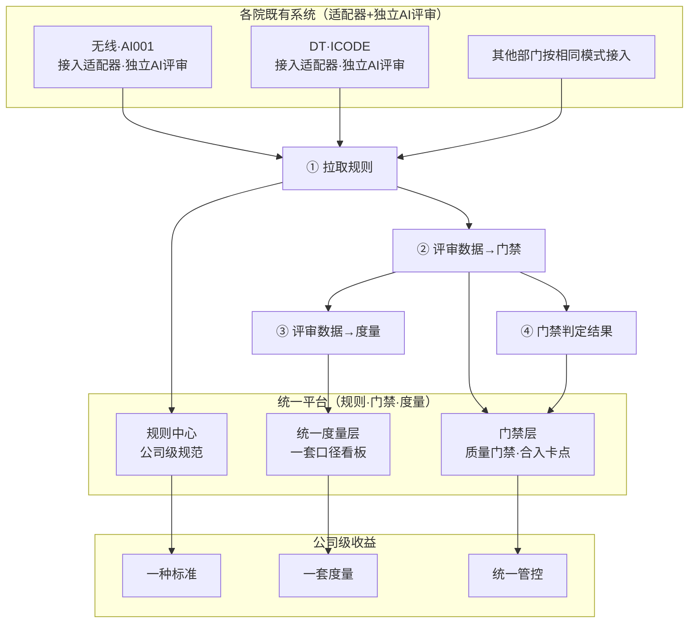

# 代码评审方案

---

## 第一章 背景

### 1.1 看业界产品

|**产品**|**核心原理**|**优势**|**劣势**|**最佳场景**|
|---|---|---|---|---|
|**阿里 OpenCodeReview（OCR）**|**确定性工程 + 自我批判校验**：AST/字节码硬筛精确定位，可插拔 LLM 裁决，再用第二轮 LLM 反思校验对抗误报。|开源可审计；模型不被锁死；Token 仅 1/9、Precision 高、成本低；易嵌入任意 CI/Agent 工具链；支持 diff 审查与全量 scan|Recall 略低（为高精度牺牲召回）；需自备 LLM key；无原生托管；弱架构级评审|多工具混用、预算敏感、要可控可审计的中大型团队；想低成本自动化 CI 审查|
|**Claude Code（CC）代码走查智能体**|**Agent Loop + Skill + 规则**：底层 agentic 循环驱动，skill 封装审查流程，规则文件约束行为；subagent 仅作隔离选项。|极致灵活可定制（loop/skill/prompt/rules/hooks 全开放）；模型代码理解力强；与开发流程无缝（就在用的 CLI 里）；本地优先、规则可审计、数据可不出域；**能审完直接改**|非开箱即用，要自己搭工作流；模型锁 Claude；无原生 PR 门禁闭环；缺团队级统一规则管理；并发/增量去重需自实现|已用 CC 做主力开发的个人/团队；需高度定制规则流程；重视本地优先、可审计；不仅想审还想直接让 agent 修|
|**Cursor Bugbot**|**多路并行 + 多数投票**：8 路并行随机化 diff、仅多路命中才置信，validator 二次过滤。|开箱即用、零运维；PR 原生集成；**自动修复闭环最强**（Autofix 派生 Cloud Agent 推分支）；多路投票显著降误报|闭源黑盒、模型/逻辑不可见；强绑 SCM 平台；按用量计费；规则不跨 .cursor；数据上云需合规评估|已重度用 GitHub/GitLab、以 PR 为核心协作流；想最快落地"提交即审+自动修"的团队|

  

---

### 1.2 公司现状

【本节阐述要点】1、 需求面： 代码量持续增加；2、实现面：有什么，怎么做的； 3、和标杆的差距，和用户需求的差距

  

代码产出率持续增加，人根本就看不过来。

|时间|全部提交行数|AI生成代码行数|AI生成占比|
|---|---|---|---|
|2024-03|2,149,589|124,246|5.78%|
|2024-04|8,824,944|576,003|6.53%|
|...|...|...|...|
|2026-07|13,893,105|6,917,252|49.79%|

  

详细数据（折叠）

|指标|全部提交的行数(文件级)|AI代码生成行数(文件级)|AI生成代码占比%|
|---|---|---|---|
|2024-03|2149589|124246|5.78|
|2024-04|8824944|576003|6.53|
|2024-05|9507750|905022|9.52|
|2024-06|9539198|1348691|14.14|
|2024-07|11542586|2027457|17.57|
|2024-08|10551290|2198000|20.83|
|2024-09|10091515|2405564|23.84|
|2024-10|9427529|2396786|25.42|
|2024-11|10676213|3082864|28.88|
|2024-12|10253195|2993265|29.19|
|2025-01|8440529|2127418|25.2|
|2025-02|7858065|2088654|26.58|
|2025-03|10277250|2610102|25.4|
|2025-04|10283337|2583268|25.12|
|2025-05|8806327|2645069|30.04|
|2025-06|9873860|3024138|30.63|
|2025-07|10629722|2879981|27.09|
|2025-08|10798172|3188039|29.52|
|2025-09|11696094|4173957|35.69|
|2025-10|9346219|3655007|39.11|
|2025-11|11755436|4922649|41.88|
|2025-12|12679555|5661545|44.65|
|2026-01|10874745|4558712|41.92|
|2026-02|6712064|2343514|34.91|
|2026-03|11599715|3156716|27.21|
|2026-04|11483436|3737304|32.55|
|2026-05|10958605|4437061|40.49|
|2026-06|13061752|5746119|43.99|
|2026-07|13893105|6917252|49.79|

**结论：** 2026年4-7月（4939万行）相对于2024年4-7月（3941万行）代码产出增加25%。**AI评审已经成为必选项**

  

  

---

### 1.3 各业务单位现状

当前各业务单位的实践和关注点：

|部门|评审系统/工具|关注点|
|---|---|---|
|无线|AI001|公司规则集管理和度量（一头一尾）以AI001为基础进行扩展，无线各项目零成本满足公司级需求|
|有线|ICODE统一触点|统一度量，复用现有配置（不要折腾大家再配置一遍），简化部署|
|DT|ICODE|rdcloud规则中心，基于Co-Mind的自研套件|

---

  

### 1.4 现有工具能力盘点与核心痛点

|维度|现状（有什么）|痛点（缺什么）|影响|
|---|---|---|---|
|规则与标准|各部门自建规则，无线AI001、DT ICODE各有规则中心|标准不统一，同一问题判定口径不同|公司缺乏统一质量基线|
|AI评审套件|各部门都有AI能力（CC、Co-Mind、OCR）|能力不齐，无法复用|重复建设、知识流失|
|门禁卡点|部分部门有门禁|未统一，无法跨部门比较|质量门禁形同虚设|
|度量与运营|各自度量，数据隔离|口径不一，无统一视图|治理无依据、改进无抓手|

**盘点结论：** 各部门"工具各异、AI能力皆有但不齐、规则各建、度量不足"。

---

  

## 第二章 业务目标与解决思路

### 2.1 愿景

以统一标准与统一度量，通过可插拔标准评审套件，让代码质量看得见、说得清、改得动。

---

### 2.2 解决思路

解决思路可归结为三条主轴：

| 主轴   | 解决什么问题       | 策略                                                             | 对应目标   |
| ---- | ------------ | -------------------------------------------------------------- | ------ |
| 标准拉通 | 标准不统一        | 把"查什么、怎么判"从各团队自定义收敛为公司级统一基线。规则以中心化方式定义与分发，各院/项目旧系统通过适配层拉取同一套标准 | 统一标准   |
| 度量拉通 | 度量缺失         | 把"怎么采集、怎么算、怎么比"统一，让分散的评审数据汇聚成公司级可比的质量视图                        | 统一度量   |
| 能力拉通 | 资产沉淀不足/AI碎片化 | 把AI评审能力做成可插拔的plugin业务套件与优秀实践，在公司层面沉淀、分发、复用                     | AI评审赋能 |

![[images/全文V1.1/0acf234378b8367f11fac98497fb493e_MD5.png]]

图一  解决思路图示（统一标准、统一度量、能力拉通）的收益

---

### 2.3 业务目标

本次建设围绕"盘活存量、统一标准、可比可治"的总目标，设定三项可衡量的业务目标：

|目标|关键结果|回应痛点|对应交付|
|---|---|---|---|
|统一标准|公司级规则中心上线|标准不统一|规则中心|
|统一度量|跨团队质量视图可比，核心指标统一口径|度量缺失|度量中心|
|AI评审赋能|plugin套件+优秀实践分发，存量能力可插拔接入|资产沉淀不足/AI碎片化|plugin套件中心&优秀业务套件|

**目标总纲：** 不做"另起炉灶的统一AI中台"，而以"公司建中枢、院/项目接入使用"的方式，把标准、度量、插件能力做成可被各院/项目拉取与上报的公共服务，让分散的评审在被拉通后形成公司级、可比、可治理的评审能力。

---

## 第三章 业务方案

【本章阐述目标】说清楚人和AI如何配合，AI什么职责AI在什么地方应用

【本章阐述要点】

1、静态检查工具 + AI + 人进行完整的质量防护，根据三者的优势和劣势进行互补设计。基本的原则：基本的问题静态检查发现，AI做深度代码评审，人做关键审查和兜底。所以这个设计上要有很多方便人进行审查和确认的需求，另一部分就是AI需要能够自进化，包括从人和工具检查这边吸收可沉淀知识，或者互补的设计

2、各个环节承担不同的职责，拦截目标不同，基本的原则： 尽量前移（由于越到后端修复成本越高），关键问题全程拦截（所以需要有一个关键问题的定义和管理机制），同时不打断正常的开发节奏

3、从规则的角度去看，综合  缺陷严重程度  + 规则检查准确性， 将不同的规则分布到不同的环节去进行检查和拦截

4、 说清楚**AI评审什么**，**什么场景下用**：AI负责规模化发现与证据组织，专家按风险等级接入判断并承担决策责任

  

### 3.1 AI与人分层协同模式

**AI负责规模化发现与证据组织，专家按风险等级介入判断并承担决策责任**

  

通过“分层协同”机制，实现AI与专家的高效分工：AI负责规模化、自动化识别，专家则聚焦高风险、高价值决策，既提升了评审效率，又保障了决策质量。层级越往上，业务风险越高，专家介入越深，责任越大；层级越往下，AI覆盖越广，自动化程度越高。

  

┌─────────────────────────────────────────────────────────┐
│  L4 架构决策                                            │
│  跨系统影响、方案权衡、架构反模式                        │
│  AI主动识别风险+生成影响报告 │ 专家决策                   │
├─────────────────────────────────────────────────────────┤
│  L3 业务语义风险                                        │
│  核心流程、业务规则一致性、数据完整性                    │
│  AI辅助识别异常模式 │ 业务专家深审                       │
├─────────────────────────────────────────────────────────┤
│  L2 通用语义风险                                        │
│  标准边界条件、常见异常处理、API契约                      │
│  AI主导分析 │ 开发人工确认                                │
├─────────────────────────────────────────────────────────┤
│  L1 高可信规则（SAST核心域）                            │
│  空指针、资源泄漏、编码规范                              │
│  SAST自动检出 │ AI辅助降噪（过滤误报）                   │
└─────────────────────────────────────────────────────────┘

**三层协同关系**：

1. **SAST与AI协同**（L1）：SAST执行确定性规则，AI优化输出质量
    
2. **AI与开发协同**（L2）：AI主导语义分析，开发确认执行
    
3. **AI与专家协同**（L3-L4）：AI提供证据和主动识别，专家判断决策
    

  

|层级|名称|关键风险点|处理方式|AI角色|专家角色|风险等级|介入程度|
|---|---|---|---|---|---|---|---|
|**L1**|高可信规则|空指针、资源泄漏、编码规范|SAST自动检出 + AI辅助降噪|**辅助降噪**：过滤SAST误报，优化告警质量；不替代规则执行|抽检AI降噪效果，调整阈值策略|低|低|
|**L2**|通用语义风险|标准边界条件、常见异常处理、API契约|AI主导分析 + 开发人工确认|**主导分析**：语义理解边界条件，识别异常处理缺失，分析API契约违背|确认AI分析结论，判断修复优先级|中|低|
|**L3**|业务语义风险|核心流程、业务规则一致性、数据完整性|AI辅助识别 + 业务专家深审|**辅助识别**：发现业务逻辑异常模式（如数据一致性风险），提供证据链|深度评审业务逻辑，判断数据流正确性|高|中|
|**L4**|架构决策|跨系统影响、方案权衡、架构反模式|AI主动识别 + 生成影响报告 + 专家决策|**主动识别**：绘制服务依赖图谱，识别级联风险、API兼容性、架构反模式；生成决策支撑报告|基于AI报告进行方案权衡，承担最终决策责任|极高|高|

  

### **协同机制要点**

  

**表格**

|**机制**|**说明**|
|---|---|
|**分层分工**|低层级（L1）以确定性规则为主，高层级（L4）以专家决策为主，AI在中间层（L2-L3）发挥核心价值|
|**降噪协同**|AI在L1层辅助过滤SAST误报，提升传统工具效率，而非替代|
|**语义增强**|AI在L2层利用语义理解能力分析边界条件和异常处理，人工仅需确认|
|**业务耦合**|L3层AI识别业务逻辑异常模式，业务专家基于AI证据进行深度评审|
|**架构主动**|L4层AI主动识别跨系统影响、架构反模式，生成影响分析报告支撑专家决策|

  

### 3.2 落地场景与流程

【本节阐述要点】 要把各层的检查要点，分配到各个流程

#### 场景总览

AI代码评审贯穿研发全流程，覆盖三个核心阶段：

|场景|流程位置|核心目标|
|---|---|---|
|场景1：本地编码时AI评审|编码中（最左，shift-left）|即时拦截缺陷，修复成本最低|
|场景2：代码提交后流水线AI评审|提交/合并门禁|质量门禁，守住上线前最后一道关卡|
|场景3：存量代码AI评审|全量/周期扫描|暴露累积风险，定位技术债|

**【图片引用】** 建议在此处插入原文档中的架构全景图（各院既有系统→适配器→统一平台→公司级收益）。

---

#### 场景1：本地编码时的AI评审

|维度|内容|
|---|---|
|**业务目标**|编码中即时拦截缺陷（shift-left），修复成本最低、上下文最新鲜。以高精确率为首要，仅高置信结论做内联提示、低置信不打扰，避免误报破坏心流；并作为"越用越好"的前端样本入口。|
|**人与系统的交互**|开发者输入代码，AI以内联波浪线/提示卡呈现高置信问题，并给"为什么"与一键修复建议（支撑验证与探索）；开发者内联采纳/忽略。提示非阻塞、低延迟、可折叠、可自定义关注点（如"重点看并发安全"）。|
|**系统与系统的交互**|IDE插件→评审引擎（增量分析当前文件/符号图）→项目索引与规范库；结果内联渲染。内联评审Agent与流水线评审Agent解耦，可独立迭代、独立降级，互不影响。|
|**业务能力定义**|实时增量分析、低延迟推理、内联呈现、上下文/符号感知、误报抑制（高精确率优先）、关注点自定义。|

**【图片引用】** 建议在此处插入原文档中的时序图（开发→IDE→编码→实时走查→请求规则→请求套件→执行走查→反馈评审结果）。

---

#### 场景2：代码提交后流水线的AI评审

|维度|内容|
|---|---|
|**业务目标**|合并/发布前用AI门禁守住质量：按业务分级判定能否上线，信任建立后分阶段扩召回；并以高资源优先服务旗舰团队、打造忠诚度。|
|**人与系统的交互**|评审者/TL在PR上看到分级报告（阻断高亮、提示折叠），一键确认/驳回（带原因）、修正等级、"为什么这样判"可展开（验证+探索，置信度/依据可见）；决策合并或放行。人只处理"机器不确定+业务关键"，确定性由系统路由。|
|**系统与系统的交互**|流水线/CI→评审服务（基于diff）→Gerrit（PR评论回写）→门禁（阻断合并/发布）→通知。确认动作即时反馈用户、模型更新异步进行（交互解耦）；各服务独立，策略引擎可热更、阈值自适应（系统策略自调）。|
|**业务能力定义**|增量/diff评审、业务分级路由、门禁对接、报告生成、并发编排、人在环采集。|

**【图片引用】** 建议在此处插入原文档中的时序图（发起PR→请求规则→请求套件→执行走查→门禁判定→反馈评审结果→评审把关→submit）。

---

#### 场景3：存量代码的AI评审

|维度|内容|
|---|---|
|**业务目标**|对存量代码做全量/周期性扫描，暴露累积风险、定位技术债与高危模块，为重构排期提供依据。召回适度放宽以多发现问题，并作为"越用越好"的大规模样本源。|
|**人与系统的交互**|架构师/负责人获得跨仓库风险看板与聚类报告，按严重度/风险分triage，一键建工单；可交互探索"哪个模块风险最高""同类问题分布"（探索支撑）。人聚焦边界裁决与remediation排期。|
|**系统与系统的交互**|批量扫描器→代码仓库克隆/索引→知识库/规则；结果→问题库/风险看板/工单系统。批量扫描器与内联、流水线Agent解耦，可定时/异步大规模运行；系统侧做数据闭环、在线评估与策略自调（呼应先精度后召回的全局切换）。|
|**业务能力定义**|全量扫描、增量索引、大规模并发、风险聚类/热力、工单联动、趋势度量。|

---

#### 场景优先级与精度/召回侧重

|序号|业务活动|在流程中的位置|打开优先级|精度/召回侧重|
|---|---|---|---|---|
|1|本地编码时AI评审|编码中（最左，shift-left）|中（体验极敏感，先保精度）|极高精确率，强抑制误报（误报会打断心流）|
|2|代码提交后流水线AI评审|提交/合并门禁|高（价值明确、可度量）|精确率优先，分阶段扩召回率（核心gate）|
|3|存量代码AI评审|全量/周期|可并行或稍后|召回率适度放宽|

---

### 3.3 业务策略

#### 3.2.1 精度优先策略

**核心原则：** 先关注精确率，再考虑召回率。

**阶段切换判据：**

|阶段|目标|置信阈值|召回策略|切换条件|
|---|---|---|---|---|
|一·冷启动|高精确率建立信任|≥0.9|牺牲召回，只说有把握的|精确率>阈值且稳定N天|
|二·渐进扩召回|在信任基础上提升覆盖|引入"疑似"分层，不直接定性|逐步扩大召回范围|人工确认耗时可控+误报率达标|

**【缺失】** "N天"和"误报率达标"的具体数值需要补充，或说明由业务方根据实际数据动态调整。

---

#### 3.2.2 分级上线策略

**业务分级与上线判定：**

对每个结论计算上线风险分 R = f(精确率校准值, 缺陷等级, 影响范围)。

|分级|触发条件|处置|
|---|---|---|
|A级·阻断|命中高危缺陷（高精确率校准）|自动阻断合并/上线，必须人工处理|
|B级·建议|中危或精度中等|强烈建议修改，允许申诉|
|C级·提示|低危或精度存疑|仅提示，不阻断，默认折叠|

**上线判定：** A级阻断项清零且综合风险分<阈值。

**【缺失】** "阈值"的具体数值或计算方式需要补充，或说明由业务方配置。

---

#### 3.2.3 资源投放策略

**核心原则：** 资源等级直接决定效果，优先投给先行标杆团队。

|资源等级|模型/算力|适用对象|目标|
|---|---|---|---|
|标准|共享大模型+规则基线|（待补充）|（待补充）|
|（待补充）|（待补充）|（待补充）|（待补充）|

**【缺失】** 原文档中此表格内容为空，需要补充完整的资源等级划分（如：标准级、增强级、旗舰级）及对应的模型/算力配置、适用对象和目标。

---

### 3.4 业务能力域

#### 3.3.1 评审知识管理

**业务目标：** 建立知识到规则的转化机制，将人工评审经验、历史缺陷、最佳实践等知识资产转化为可执行的评审规则。

**知识来源：**

- 人工评审经验（资深工程师的评审记录）
    
- 历史缺陷（线上问题、故障复盘）
    
- 最佳实践（编码规范、设计模式）
    

**知识转化机制：**

**【缺失】** 原文档中此部分只有标题"评审知识方案"和"参考"二字，以及"人工评审转AI评审规则"的标题。需要补充：

1. 人如何参与知识转化（如：专家标注、规则评审）
    
2. 系统如何参与知识转化（如：自动挖掘、聚类分析）
    
3. 知识转化的流程（从知识采集到规则发布的闭环）
    

---

#### 3.3.2 评审规则与门禁应用

【待完善】【章节撰写要求】基于规则下发公司要求，基于规则执行门禁要求

【缺失】门禁推进策略，即什么时候推进什么门禁要求，基于规则的治理要求

**业务目标：** 建立公司级规则治理体系，实现规则的分层管理、分类管理和全生命周期管理。

**规则分层：**

|层级|定义|管理主体|
|---|---|---|
|公司级|全公司统一适用的质量基线|公司级质量团队|
|院级|各研究院/研发中心适用的规范|院级质量团队|
|项目级|特定项目自定义的补充规则|项目团队|

**规则分类：**

|类别|说明|
|---|---|
|安全性|安全漏洞、注入风险、敏感信息泄露等|
|可靠性|空指针、资源泄漏、并发竞态、异常处理等|
|规范性|编码规范、命名规范、注释规范等|

**规则生命周期：**

**【缺失】** 需要补充规则从创建、评审、发布、生效到废止的全生命周期流程，以及每个阶段的人机协作机制。

**规则属性（业务语义）：**

|属性|业务含义|
|---|---|
|severity|缺陷严重程度：P0（阻断）/ P1（高危）/ P2（中危）/ P3（低危）|
|scope|生效范围：project（项目级）/ module（模块级）/ file（文件级）|

**【缺失】** 需要补充业务视角的规则治理需求：

- 规则如何分级审批？
    
- 规则变更如何通知下游？
    
- 规则效果如何评估和回收？
    

**【注意】** 此处只描述业务语义，不涉及具体字段格式。字段格式定义见附录B。

**【图片引用】** 建议在此处插入原文档中的规则对比图（OCR全量规则模块 vs 新系统渐进式规则模块）。

---

#### 3.3.3 质量度量

**业务目标：** 通过汇聚评审数据，构建可比、可量化的质量度量体系，实现评审质量的"可视、可溯、可落地"。在此基础上，依托数据洞察反哺公司级规范升级与优质评审plugin套件甄选，打造"以度量驱动标准迭代、以数据赋能能力进化"的持续演进飞轮。

**度量指标体系：**

|指标|业务含义|用途|
|---|---|---|
|精确率|AI评审正确发现问题的比例|衡量AI评审质量，指导精度策略|
|召回率|AI评审发现问题占所有问题的比例|衡量AI评审覆盖度，指导召回策略|
|采纳率|开发者采纳AI评审建议的比例|衡量AI评审价值，指导规则优化|

**【缺失】** 原文档中度量指标表格内容混乱，需要重新整理。正文只保留指标名称和业务含义，公式和计数器定义见附录C。

**度量驱动闭环：**

**【缺失】** 需要补充"度量驱动闭环"的流程描述，说明：数据采集→洞察分析→标准迭代→能力进化→效果验证的闭环机制。

**【图片引用】** 建议在此处插入原文档中的度量看板截图（各中心AI代码评审Checker数据统计）。

---

#### 3.3.4 能力评测

**业务目标：** 建立统一的能力评测体系，为代码评审套件提供质量标尺，驱动优胜劣汰与持续改进。

**评测标准：**

**【缺失】** 原文档中"评测方案"部分只有标题，没有内容。需要补充：

1. 评测什么：套件的能力维度（精确率、召回率、性能、覆盖率等）
    
2. 怎么判定优劣：基准线设定、横向对比机制
    
3. 优胜劣汰的业务机制：套件如何上架、如何下架、如何升级
    

**评测类型（业务视角）：**

|评测类型|业务说明|
|---|---|
|离线回归评测|新套件发布前，用历史数据集验证是否退化|
|在线评测|生产环境灰度发布，对比新旧套件效果|
|评测集管理|维护标准评测数据集，确保评测可比性|

**【注意】** 此处只描述业务机制，不涉及具体评测算法。评测方法细节见附录D。

---

### 3.4 评审业务分类

**按评审深度分类：**

|场景编号|场景|评审对象|场景优先级|场景分析|
|---|---|---|---|---|
|场景1|基于规则的语法级评审|代码缺陷、编码规范|1|可行性最高，探索充分，优先实施：规范较为确定，大模型对于语法逻辑理解能力强|
|场景2|基于规则的设计规约评审|项目设计规约：架构规约、业务规约、clean code|2|可行性高，未探索，随后探索：初步判断可基于rules机制|
|场景3|业务逻辑评审|业务逻辑|3|与代码生成的逻辑一致，是否实施待论证|

**【缺失】** 需要补充：场景优先级与3.1中三个流程场景的对应关系（如：场景1主要对应编码时和PR阶段；场景2主要对应PR阶段；场景3待论证暂不实施）。

---

## 第四章 系统设计

### 4.1 总体架构

**架构原则：**

1. **解耦原则：** 业务套件与引擎解耦，执行过程可随意替换升级
    
2. **可插拔原则：** 各部门按需接入，存量能力通过适配层接入
    
3. **不推倒重来原则：** 公司建中枢、院/项目接入使用，既有系统通过适配层拉取与上报
    

**现有机制：**

- 业务套件机制： 执行逻辑和执行引擎分离
    

**4层架构：**

**【图片引用】** 建议在此处插入原文档中的4层架构图（场景→业务套件→Agent引擎→评审规则/评审服务）。

![[images/全文V1.1/f119981b3abd30735e88f3e5f2374201_MD5.png]]

**架构优势：** 执行过程可随意替换升级，但质量标准和度量数据全局统一。

---

### 4.2 子系统划分与职责

|子系统|定位|核心职责|支撑的业务能力|与其他子系统的关系|
|---|---|---|---|---|
|规则中心|为公司各院、各项目的代码评审规则提供集中化的定义、存储和分发能力|规则生命周期管理、规则分类与标签、规则集编排、版本管理与变更追溯、规则分发与同步、规则效果度量|3.3.2 评审规则治理|输入：评审知识管理（知识转化后的规则）；输出：规则分发至各院适配器、规则数据至度量中心|
|度量中心|统一公司代码门禁、代码检查、编码规范等数据模型，建立统一度量指标体系与数据采集、存储、清洗流程|度量指标定义与管理、数据采集与入湖、数据清洗与质量治理、度量看板、效果评估与反馈闭环|3.3.3 质量度量|输入：各子系统评审数据；输出：质量视图、洞察报告|
|门禁系统|在开发过程杜绝代码污染源|集成&测试&外场等环节的质量门禁、合入卡点|3.1 场景2 PR阶段评审|输入：评审结果；输出：门禁判定|
|测评系统|为代码评审套件提供统一的能力标尺与质量门禁|评测集管理、自动化测评执行、多维度指标计算、性能测评、测评报告生成、基线管理与门禁判定、版本对比、套件间对比|3.3.4 能力评测|输入：套件；输出：测评报告、优胜劣汰建议|
|观测系统|为代码评审系统提供全链路可观测|链路追踪、运行监控、指标告警|跨场景支撑|输入：各子系统运行数据|
|自进化系统|将人的反馈转为评审套件的持续进化动力|反馈采集、反馈分析与归因、套件优化、效果验证、安全兜底（人工审批、回滚）|3.3.1 评审知识管理|输入：用户反馈；输出：优化后的套件|
|套件市场|为代码评审套件提供分级发布、分发与治理平台|准入与发布、检索与发现、接入与分发、层级管理（公司级、院级、项目级）、治理、版本管理、生态运营|3.3.4 能力评测|输入：测评通过的套件；输出：分发至各院适配器|

**【缺失】** 原文档中门禁系统、观测系统、自进化系统、套件市场的描述较为简略，需要补充完整。

---

### 4.3 子系统间关系与数据流

**【缺失】** 需要补充子系统间的数据流描述，或引用原文档中的架构图（统一输入→评审执行面→统一报告）。

---

### 4.4 既有系统适配与接入机制

**既有系统清单：**

- 无线·AI001
    
- DT·ICODE
    
- 其他部门按相同模式接入
    

**适配层职责：**

- 规则拉取：从规则中心拉取公司级规范
    
- 评审数据上报：将评审结果上报至度量中心
    
- 门禁对接：与既有门禁系统对接
    

**接入方式：** 适配器模式，各部门按需接入，不推倒重来。

**【图片引用】** 建议在此处插入原文档中的架构图（各院既有系统→适配器+独立AI评审→统一平台→公司级收益）。

---

### 4.5 业务能力到子系统的映射

|业务能力域|业务场景|支撑子系统|
|---|---|---|
|3.3.1 评审知识管理|知识→规则转化|自进化系统、规则中心|
|3.3.2 评审规则治理|规则分层/分类/生命周期|规则中心|
|3.3.3 质量度量|统一度量视图|度量中心|
|3.3.4 能力评测|套件优胜劣汰|测评系统、套件市场|
|3.1 场景1 编码时评审|实时走查|IDE插件、评审引擎、规则中心|
|3.1 场景2 PR阶段评审|质量门禁|流水线、评审服务、门禁系统|
|3.1 场景3 存量治理|全量扫描|批量扫描器、度量中心|

---

## 第五章 实施路径与任务分工

### 5.1 建设阶段划分

|阶段|目标|核心子系统|
|---|---|---|
|一期|基础能力建设|规则中心、度量中心|
|二期|质量管控+生态建设|门禁系统、套件市场|
|三期|持续进化|测评系统、自进化系统|

**【缺失】** 需要补充各阶段的时间规划和交付物。

---

### 5.2 各子系统Owner与依赖关系

|子系统|建议Owner|依赖|
|---|---|---|
|规则中心|（待分配）|无|
|度量中心|（待分配）|规则中心（数据模型）|
|门禁系统|（待分配）|评审服务|
|测评系统|（待分配）|套件市场|
|观测系统|（待分配）|各子系统|
|自进化系统|（待分配）|套件市场、度量中心|
|套件市场|（待分配）|测评系统|

**【缺失】** 需要明确各子系统的Owner团队。

---

### 5.3 与既有系统改造的协同节奏

|既有系统|改造内容|协同节奏|
|---|---|---|
|无线·AI001|接入适配器，拉取规则，上报数据|一期完成|
|DT·ICODE|接入适配器，拉取规则，上报数据|一期完成|

**【缺失】** 需要补充更多既有系统的改造计划。

---

### 5.4 里程碑与交付节奏

|里程碑|时间|交付物|
|---|---|---|
|规则中心上线|（待补充）|公司级规范与规则中心|
|度量视图可比|（待补充）|跨团队质量视图|
|AI评审赋能|（待补充）|plugin套件中心|

**【缺失】** 需要补充具体时间节点。

---

## 第六章 风险识别与保障措施

### 6.1 主要风险

|风险类型|风险描述|
|---|---|
|技术风险|AI评审准确率不达预期、大模型Token成本过高|
|协同风险|多团队协作依赖复杂、既有系统改造阻力|
|业务风险|用户接受度低、误报率过高导致抵触|

---

### 6.2 应对策略与保障机制

|风险|应对策略|
|---|---|
|技术风险|精度优先策略、分阶段召回、资源分级投放|
|协同风险|明确Owner、建立跨团队沟通机制|
|业务风险|先行标杆团队、效果可视化、反馈闭环|

**【缺失】** 需要补充更详细的风险应对措施和保障机制。

---

## 附录

### 附录

### 附录A 关键技术识别

#### A.1 上下文增强

**【缺失】** 需要补充上下文增强技术的描述。

#### A.2 规则挖掘

**【缺失】** 需要补充规则挖掘技术的描述。

---

### 附录B 规则格式参考

**规则字段定义：**

|序号|字段名|类型|是否必填|
|---|---|---|---|
|1|checkerId|字符串|是|
|2|version|字符串|是|
|3|category|字符串|是|
|4|（待补充）||是|
|5|detail|字符串|是|
|6|severity|枚举(P0/P1/P2/P3)|是|
|7|scope|枚举(project/module/file)|是|
|8|说明|富文本|是|
|9|检查点|列表|是|
|10|反例|代码块列表|是|
|11|正例|代码块列表|是|
|12|加载策略|字符串|是|

**【缺失】** 第4个字段名缺失。

**规则实例：**

checker_id: "1.3.2.3.0"

checker_path: "rules/ruleset-001/C&C++/安全性/1.3.2.3.0-if--else-if链缺少else.md"

checker_name: "代码中if...else if 分支未覆盖"

filename: "src/netif/ppp/utils.c"

start_line: 964

end_line: 974

category: "安全性"

subcategory: "规范"

detail: "代码中if...else if 分支未覆盖"

defect: "函数ppp_proto_is_control()中的if...else if 链(判断协议是否为LCP(0xc021)/IPCP(0x8021)/PAP(0xc023))缺少最终的else 分支。根据规则要求,只要有if结构就必须有trailing else。缺失else 分支可能导致其他协议值未被正确处理,造成逻辑漏洞。"

reviewer: "SE-OCR(agent-code-review)"

  

**OCR vs fast-acr vs ai001-cloud对比：**

|指标|fast-acr|ai001-cloud|ocr-cloud|
|---|---|---|---|
|MATCH率|3/4 (75%)|1/4 (25%)|2/4 (50%)|
|Precision|100.00%|71.43%|62.50%|
|Recall|88.89%|55.56%|55.56%|
|F1|0.9412|0.6250|0.5883|
|噪声率|0.00%|28.57%|37.50%|
|总分|8.0/9.0 (88.89%)|4.0/9.0|3.5/9.0|
|总耗时|1027s|3039s (2.96×)|1634s (1.59×)|
|总Token|1.25M|4.06M (3.25×)|2.75M (2.20×)|
|每得1分Token|156K|1016K (6.5×)|786K (5.0×)|

---

### 附录C 度量指标公式

**精确率：**

精确率 = (AI评审采纳数 + AI评审拒绝但有效数) / AI评审反馈数

  

**主要计数器：**

- AI评审采纳数：对于AI评审点击Done的次数
    
- AI评审拒绝但有效数：对于AI评审点击Reply且回复内容包括[valid]的次数
    
- AI评审反馈数：对于AI评审点击Done或Reply的次数
    

**【缺失】** 原文档中度量指标表格内容混乱，需要重新整理完整的公式和计数器定义。

---

### 附录D 评测方法参考

**【缺失】** 需要补充评测方法的详细描述。

---

### 附录E 参考数据

**代码产出率数据表（2024.03-2026.07）：**

（完整数据表见1.3节，建议移至此处）

---

  

## 全文缺失内容汇总

|缺失项|位置|优先级|说明|
|---|---|---|---|
|趋势对公司的启示|1.1末尾|中|衔接趋势与痛点|
|无线·中研关注点|1.2表格|高|补齐各业务单位现状|
|其他部门实践|1.2表格|高|补齐各业务单位现状|
|场景全景图|3.1开头|高|展示三个场景位置|
|场景1/2时序图|3.1场景末尾|中|引用原文档图片|
|场景3详细描述|3.1场景3|高|参考场景1/2模板|
|N天和误报率数值|3.2.1|中|或说明动态调整|
|风险分阈值|3.2.2|中|或说明业务配置|
|资源等级完整表格|3.2.3|高|补充等级划分|
|知识转化机制|3.3.1|高|人+系统协作流程|
|规则生命周期|3.3.2|高|创建→废止流程|
|规则治理业务需求|3.3.2|中|审批/通知/回收|
|度量驱动闭环|3.3.3|中|流程描述|
|能力评测业务机制|3.3.4|高|评测维度/基准线/优胜劣汰|
|场景与流程对应关系|3.4|中|场景1/2/3与编码时/PR/存量映射|
|子系统间数据流|4.3|中|或引用架构图|
|各子系统Owner|5.2|高|明确责任团队|
|既有系统改造计划|5.3|高|补充更多系统|
|里程碑时间节点|5.4|高|明确时间规划|
|风险应对措施细节|6.2|中|补充保障机制|
|上下文增强技术|附录A.1|低|技术描述|
|规则挖掘技术|附录A.2|低|技术描述|
|规则第4字段名|附录B|低|补充字段名|
|度量公式完整版|附录C|中|重新整理表格|
|评测方法|附录D|中|补充详细描述|